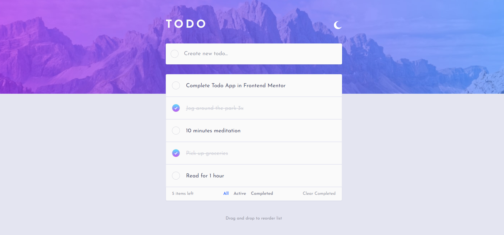

# Frontend Mentor - Todo app solution

This is a solution to the [Todo app challenge on Frontend Mentor](https://www.frontendmentor.io/challenges/todo-app-Su1_KokOW).

## Table of contents

-   [Overview](#overview)
    -   [The challenge](#the-challenge)
    -   [Screenshot](#screenshot)
    -   [Links](#links)
-   [My process](#my-process)
    -   [Built with](#built-with)
-   [Author](#author)

## Overview

### The challenge

Users should be able to:

-   View the optimal layout for the app depending on their device's screen size
-   See hover states for all interactive elements on the page
-   Add new todos to the list
-   Mark todos as complete
-   Delete todos from the list
-   Filter by all/active/complete todos
-   Clear all completed todos
-   Toggle light and dark mode
-   **Bonus**: Drag and drop to reorder items on the list

### Screenshot

### Links

<!-- - Solution URL: [Add solution URL here](https://your-solution-url.com) -->

-   Live Site URL: [React Todo App](https://thariqaudah.github.io/react-todo-app)

## My process

### Built with

-   Semantic HTML5 markup
-   Tailwind CSS
-   React.js
-   Typescript

## Author

<!-- - Website - [Add your name here](https://www.your-site.com) -->

-   Frontend Mentor - [@thariqaudah](https://www.frontendmentor.io/profile/thariqaudah)
<!-- - Twitter - [@yourusername](https://www.twitter.com/yourusername) -->
